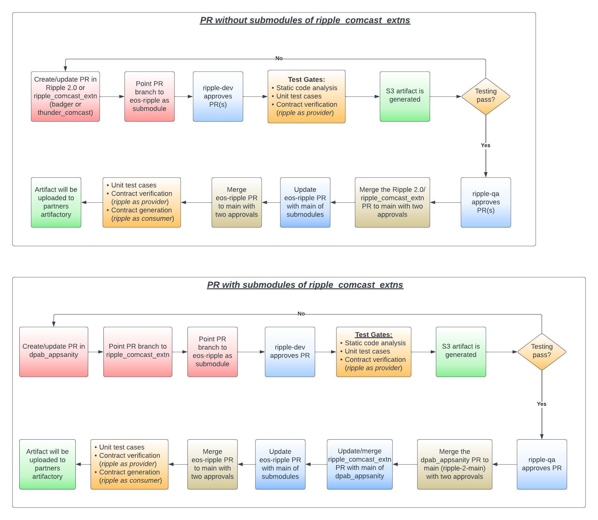

# Pull Requests

See [project_structure for layout](../code/project_struture.md)

Pull Requests (PRs) are run from "bottom up": for instance, if a change is made to dpab_appsanity, then
it involves:
1) a dpab_appsanity PR
2) ripple_comcast_extns PR
3) eos-ripple PR

EOS Ripple PRs require QA approval prior to merge. All lower level (dpab_sanity, ripple_comcast_exnts in this example) PRs require developer( 2) approval

PRs to Ripple require special formatting

